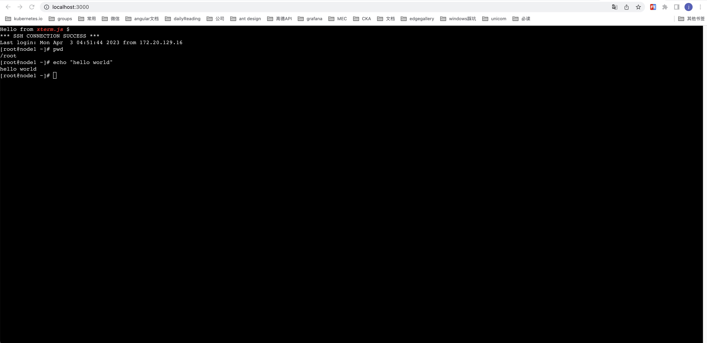

# 环境依赖

- node: v16.16.0

# 后端

## cd 到后端目录

```shell
cd server
```

## install 后端依赖

```shell
npm install
```

## 更新ssh的ip和用户名、密码

```shell
# 文件位置: server/src/main.ts
# 页面ssh到的目标服务器地址
app.ws('/', function (ws: any, req: any) {
  createNewServer({
    host: '127.0.0.1',
    username: 'root',
    password: '123456'
  }, ws)
});
```

## 起后端server

```shell
npm run start
```

# 前端

## cd 到前端目录

```shell
cd frontend
```

## install 前端依赖

```shell
npm install
```

## 起前端server

```shell
npm run start
```

# 访问前端地址



